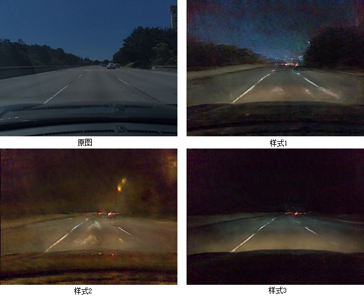
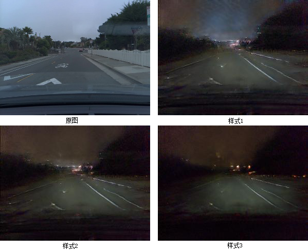
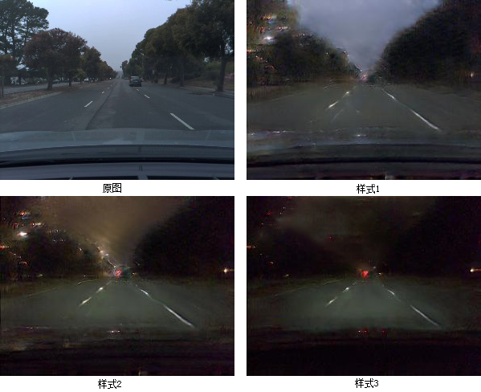
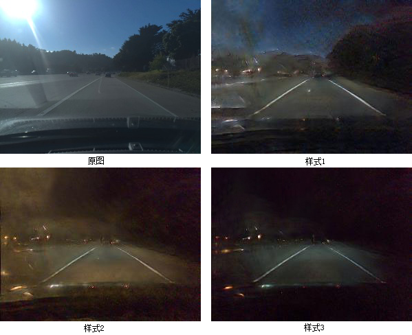
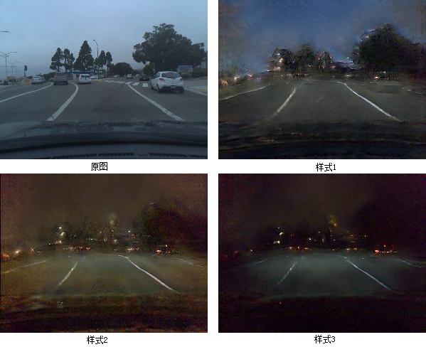
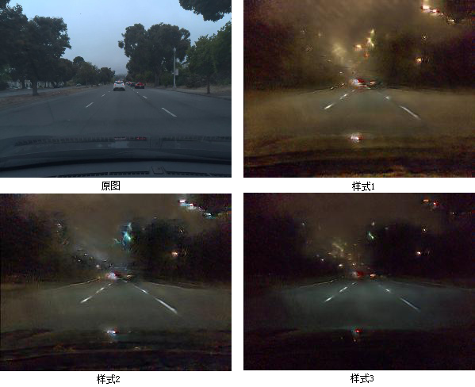

# “Visual Environment Generation Based on Unsupervised Machine Learning for Driving Simulator"

# Version
* Tensorflow 1.4
* Python 3.6

#Abstract 
In recent years, automatic driving has become one of the hot topics in the automotive industry. It is pointed out that fully autonomous vehicles must travel hundreds of millions of miles to prove their reliability in safety. In addition, reinforcement learning of autopilot models requires sufficient road driving for iterative training. At present, many research institutes and manufacturer of automatic driving put the model of automatic driving agent into the virtual driving environment of computer simulation for training or testing.
Existing data-driven and neural network generation methods can generate more realistic driving environment images, but they can not control driving environment modes (such as atmospheric conditions, lighting conditions). To solve this problem, based on the multi-modal image generation framework, this paper generates driving environment images according to the semantic layout and can construct real images under various illuminations. The specific work is as follows:
1. This paper introduces the concept of partially shared hidden space to realize the modal control of driving environment. Image representation can be decomposed into content-invariant implicit codes with respect to domain and stylistic implicit codes with specific attributes represented by capture. Random Style Hidden Code allows one-to-many mapping, learning the conditional distribution of the corresponding image in the target domain.
2. This paper realizes the generation of street scene images with semantic layout and tests the contribution of frame continuity of fixed-style coded video. The numerical examples show that the method in this paper can generate driving environment with high simulation degree, and the fixed style code can improve the video time continuity.
3. Based on the multi-modal method, the illumination control of driving image is realized. In this paper, Comma2K19 traffic data set is divided into two domains, day and night, and the network is trained. The daytime driving image can be converted into night image or reverse conversion, and the illumination condition can be controlled in a field.
To sum up, this paper studies the modal control method of high simulation virtual driving environment, and takes illumination condition control as an example to carry out experiments. This is of great significance to the rapid construction of the virtual simulation platform for automatic driving, and has important research significance and application value.

Key Words：Virtual Driving Environment；Deep Learning；Multimodal

# Samples of Illumination Control

